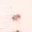
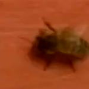

# The problem
## ANNs
For the first project of cs5600 we were tasked with developing, and training a ANN that could classify images as either BEE or NO BEE using the data from the BEE1 and BEE2 datasets and another ANN for the BUZZ1 and BUZZ2 datasets. 

## CNNs
For the second project of cs5600 we were tasked with developing, and training a CNN that could classify images using the data from the BEE1 and BEE2 datasets and another CNN for the BUZZ1 and BUZZ2 datasets. 
 
## Dataset

BEE1 contains 54,382 32x32 images hand labeled as BEE or NO-BEE

 

BEE2 contains 112,879 90x90 images hand labeled as BEE or NO-BEE (This is divided into BEE2_1S and BEE2_2S)

 

BUZZ1 contains 10,260 audio samples hand labeled as BEE, CRICKET, or, NOISE

Examples can be found [here](https://github.com/Thedegreeisalie/cs5600/BUZZ1/)

BUZZ2 contains 12,914 audio samples hand labeled as BEE, CRICKET, or, NOISE

Examples can be found [here](https://github.com/Thedegreeisalie/cs5600/BUZZ2/)

## BEE1

The first ANN was a simple three fully connected layers with relu activation function for the first layer and softmax for the remaining layers. 
 
The code can be found [here](https://github.com/Thedegreeisalie/cs5600/blob/master/project1/ANN_BEE1_3Layer.py)

Training for roughly 100 epochs gave a training accuracy of near .99, and an evaluation accuracy comparable
	
	Run id: ANN_BEE1_3Layer
	Log directory: /tmp/tflearn_logs/
	---------------------------------
	Training samples: 43512
	Validation samples: 10879
	--
	Training Step: 136680  | total loss: 0.02243 | time: 37.906s
	| SGD | epoch: 001 | loss: 0.02243 - acc: 0.9901 | val_loss: 0.01450 - val_acc: 0.9971 -- iter: 43512/43512
	--

The CNN resulted in roughly the same training and evaluation accuracy in roughly 100 epochs. (Ran it overnight for 200 epochs with little improvement)

	Run id: CNN_BEE1_4Layer
	Log directory: /tmp/tflearn_logs/
	---------------------------------
	Training samples: 43512
	Validation samples: 10879
	--
	Training Step: 137360  | total loss: 0.01202 | time: 202.871s
	| SGD | epoch: 001 | loss: 0.01202 - acc: 0.9937 | val_loss: 0.00373 - val_acc: 0.9988 -- iter: 43512/43512
	--

## BEE2

The increased size of the images in BEE2 made it harder to process due to hardware constriants (only finite memory darnint) so by introduceing greyscaling gave a accuracy of ~80 happened overnight in roughly 50 epochs

	Run id: ANN_Bee2_1S_5Layer_relu_grayscale
	Log directory: /tmp/tflearn_logs/
	---------------------------------
	Training samples: 46498
	Validation samples: 11625
	--
	Training Step: 74154  | total loss: 0.27864 | time: 830.641s
	| SGD | epoch: 001 | loss: 0.27864 - acc: 0.8821 | val_loss: 0.34857 - val_acc: 0.8354 -- iter: 46498/46498
	--

	Run id: ANN_Bee2_2S_5Layer_relu_grayscale 
	Log directory: /tmp/tflearn_logs/
	---------------------------------
	Training samples: 32806
	Validation samples: 21872
	--
	Training Step: 5643  | total loss: 0.31652 | time: 653.469s 
	| SGD | epoch: 001 | loss: 0.31652 - acc: 0.8736 | val_loss: 0.32531 - val_acc: 0.8694 -- iter: 32806/32806

The CNNs had just a little bit more luck than the ANNs
	
	Run id: CNN_BEE2_1s_4Layer
	Log directory: /tmp/tflearn_logs/
	---------------------------------
	Training samples: 46498
	Validation samples: 11625
	--
	Training Step: 37077  | total loss: 0.09449 | time: 840.953s
	| SGD | epoch: 001 | loss: 0.09449 - acc: 0.9677 | val_loss: 0.11097 - val_acc: 0.9592 -- iter: 46498/46498
	--
	
	Run id: CNN_BEE2_2s_4Layer
	Log directory: /tmp/tflearn_logs/
	---------------------------------
	Training samples: 43742
	Validation samples: 10936
	--
	Training Step: 69084  | total loss: 0.03981 | time: 784.843s
	| SGD | epoch: 001 | loss: 0.03981 - acc: 0.9883 | val_loss: 0.03517 - val_acc: 0.9884 -- iter: 43742/43742
	--

## BUZZ1

The audio data has a little more than random chance of being classified correctly in this case
	
	---------------------------------
	Run id: ANN_BUZZ1_dropout.tfl
	Log directory: /tmp/tflearn_logs/
	---------------------------------
	Training samples: 6000
	Validation samples: 1150
	--
	2019-11-03 17:46:26.289077: W tensorflow/core/framework/allocator.cc:108] Allocation of 1173060000 exceeds 10% of system memory.
	2019-11-03 17:46:28.809158: W tensorflow/core/framework/allocator.cc:108] Allocation of 1173060000 exceeds 10% of system memory.
	2019-11-03 17:46:31.243580: W tensorflow/core/framework/allocator.cc:108] Allocation of 1173060000 exceeds 10% of system memory.
	2019-11-03 17:46:33.747543: W tensorflow/core/framework/allocator.cc:108] Allocation of 1173060000 exceeds 10% of system memory.
	Training Step: 94  | total loss: 1.09864 | time: 270.599s 0192/6000
	| SGD | epoch: 001 | loss: 1.09864 - acc: 0.3390 | val_loss: 1.09779 - val_acc: 0.4348 -- iter: 6000/6000
	--

The CNNs proved just a little bit more successful, but not by much, but still with a large drop in validation accuracy .
	
	Run id: CNN_Buzz1_5Layer.tfl
	Log directory: /tmp/tflearn_logs/
	---------------------------------
	Training samples: 8905
	Validation samples: 1150
	--
	Training Step: 3640  | total loss: 0.13612 | time: 688.281s
	| SGD | epoch: 001 | loss: 0.13612 - acc: 0.9446 | val_loss: 1.21757 - val_acc: 0.6400 -- iter: 8905/8905

## BUZZ2

	Run id: ANN_Buzz2_5Layer.tfl
	Log directory: /tmp/tflearn_logs/
	---------------------------------
	Training samples: 7582
	Validation samples: 2332
	--
	Training Step: 3094  | total loss: 0.17278 | time: 545.472s
	| SGD | epoch: 001 | loss: 0.17278 - acc: 0.9482 | val_loss: 6.04108 - val_acc: 0.4597 -- iter: 7582/7582

The CNNs again had much better success than the ANNs but they were just above random for the validation accuracy.

	Run id: CNN_Buzz2_5Layer.tfl
	Log directory: /tmp/tflearn_logs/
	---------------------------------
	Training samples: 7582
	Validation samples: 2332
	--
	Training Step: 3094  | total loss: 0.13692 | time: 547.728s
	| SGD | epoch: 001 | loss: 0.13692 - acc: 0.9640 | val_loss: 6.84104 - val_acc: 0.4374 -- iter: 7582/7582
	--

